# Домашнее задание к занятию 4 «Оркестрация группой Docker контейнеров на примере Docker Compose»

## Задача 1

Docker и docker compose plugin установлены, Docker Hub доступен (зеркала не понадобились).

Скачан образ:

```console
$ docker pull nginx:1.29.0
...
Digest: sha256:3ab4ed065a1437cbbd45e65617b1285bdf6523c6bf56a121e00df41720e09a89
Status: Downloaded newer image for nginx:1.29.0
```

`index.html`:

```html
<html>
<head>
Hey, Netology
</head>
<body>
<h1>I will be DevOps Engineer!</h1>
</body>
</html>
```

`Dockerfile`:

```dockerfile
FROM nginx:1.29.0
COPY index.html /usr/share/nginx/html/index.html
```

Сборка и публикация в публичный репозиторий Docker Hub `bokkote11/custom-nginx`:

```console
$ docker build -t custom-nginx:1.0.0 .
...
#7 naming to docker.io/library/custom-nginx:1.0.0 done

$ docker login -u bokkote11
Login Succeeded

$ docker tag custom-nginx:1.0.0 bokkote11/custom-nginx:1.0.0
$ docker push bokkote11/custom-nginx:1.0.0
fea7cebc499c: Mounted from library/nginx
856c000ad0ec: Mounted from library/nginx
27cc0cc68aef: Pushed
1.0.0: digest: sha256:005dc2690855f5734c6d584c59a32bc6539daa48ec1b327fcccab00991d42106 size: 856
```

Ссылка на репозиторий: **https://hub.docker.com/r/bokkote11/custom-nginx**

---

## Задача 2

Запуск контейнера с требуемым именем, в фоне, с публикацией на `127.0.0.1:8080`, затем переименование без удаления:

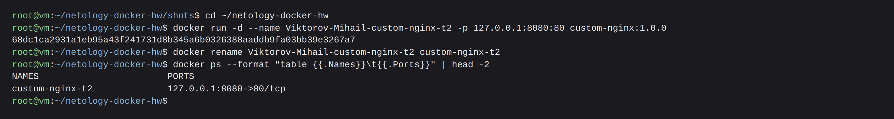

Выполните команду `date +"%d-%m-%Y %T.%N %Z" ; sleep 0.150 ; docker ps ; ss -tlpn | grep 127.0.0.1:8080  ; docker logs custom-nginx-t2 -n1 ; docker exec -it custom-nginx-t2 base64 /usr/share/nginx/html/index.html`:

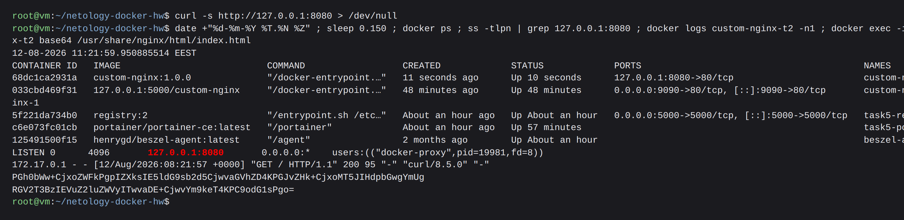

Индекс-страница доступна:

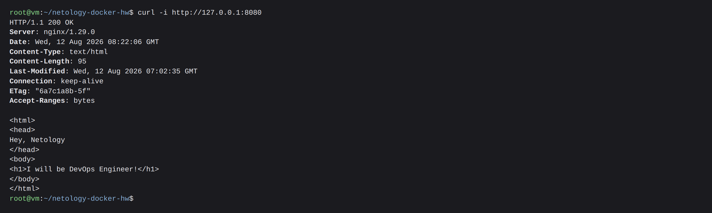

---

## Задача 3

**1–3.** Подключиться к стандартным потокам ввода/вывода/ошибок запущенного контейнера позволяет команда **`docker attach`**. Подключаемся и нажимаем `Ctrl-C`:

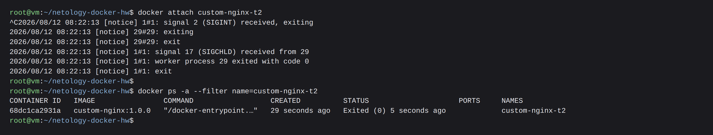

`docker attach` по умолчанию работает с `--sig-proxy=true`, то есть проксирует сигналы с терминала в главный процесс контейнера (PID 1). Нажатие `Ctrl-C` отправило `SIGINT` не docker-клиенту, а самому nginx внутри контейнера - это видно прямо в логе: `signal 2 (SIGINT) received, exiting`. Для nginx `SIGINT` - это команда немедленного завершения.

**4–6.** Перезапускаем контейнер, заходим в интерактивный bash и ставим редактор:

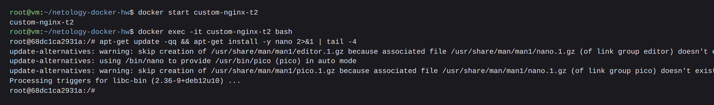

**7.** Открываем `/etc/nginx/conf.d/default.conf` в nano:

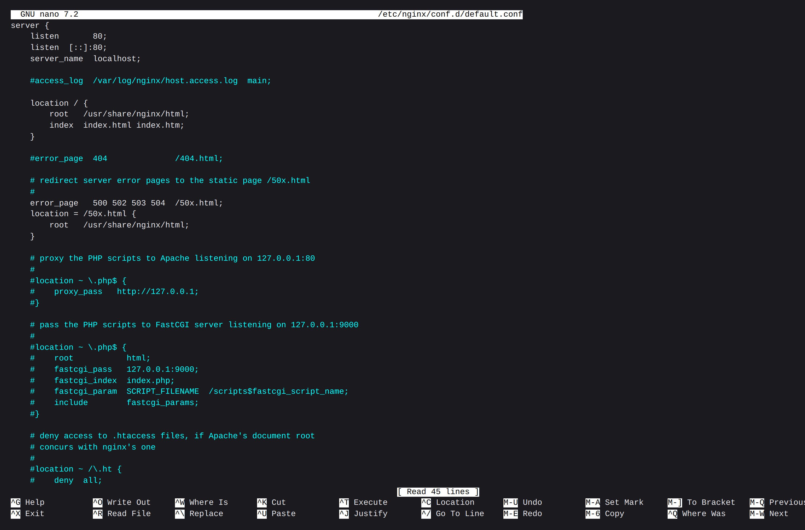

Меняем `listen 80` на `listen 81`:

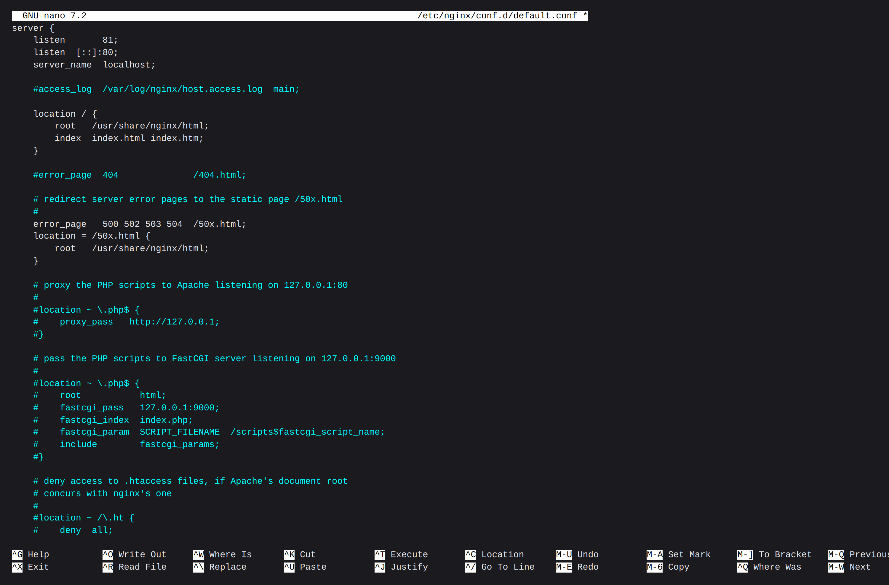

**8.** `nginx -s reload` перечитал конфиг: 80-й порт внутри контейнера больше не слушается, страницу теперь отдаёт 81-й.

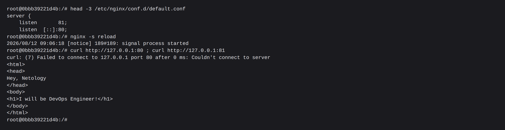

**9–10.** Выходим из контейнера (`exit`) и проверяем снаружи:

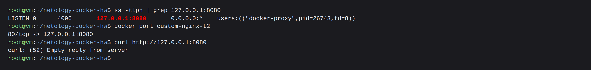

Публикация порта — это свойство контейнера, а не nginx. Правило проброса было зафиксировано при `docker run` и живёт независимо от того, что происходит внутри. На хосте `127.0.0.1:8080` по-прежнему слушается, но приложение внутри переехало на 81. Трафик исправно доставляется на 80-й порт контейнера, где его уже никто не ждёт.

**12.** Удаление работающего контейнера без остановки — `docker rm -f`:

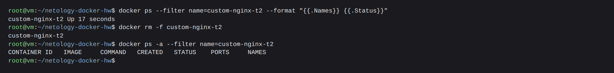

---

## Задача 4

Запускаем два контейнера, примонтировав в оба один и тот же каталог хоста в `/data`:

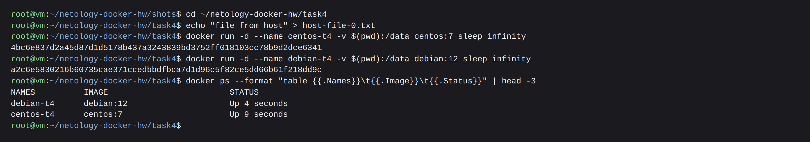

Создаём файл из первого контейнера и добавляем ещё один с хоста:

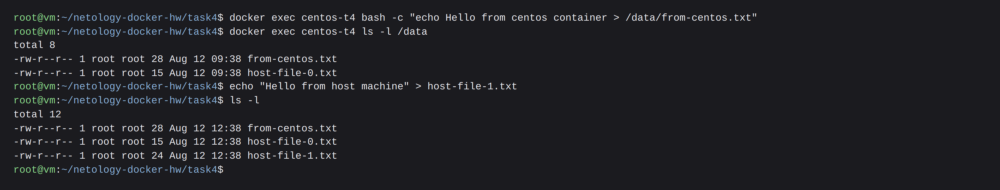

Смотрим из второго контейнера — видны оба файла и их содержимое:

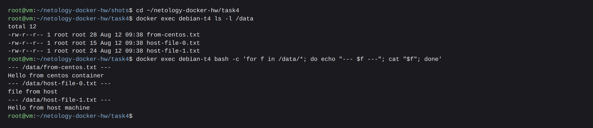

Bind mount — это один и тот же каталог на хосте, поэтому изменения из любого источника (хост, любой из контейнеров) сразу видны всем остальным.

---

## Задача 5

**1.** Создаём каталог и два манифеста:

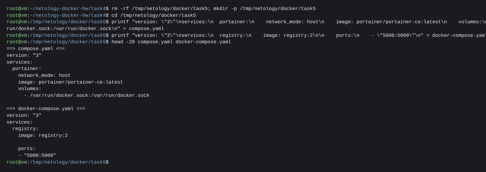

```console
$ docker compose up -d
```

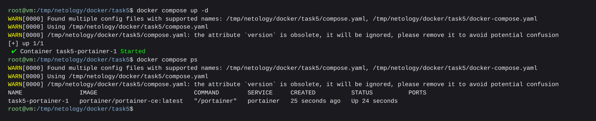

**Запустился `compose.yaml`** — поднялся только portainer. Compose ищет манифест по списку имён в фиксированном порядке приоритета, и канонические `compose.yaml`/`compose.yml` стоят выше исторических `docker-compose.yaml`/`docker-compose.yml`.

**2.** Чтобы поднялись оба, подключаем второй манифест через `include`:

```yaml
include:
  - docker-compose.yaml

services:
  portainer:
    network_mode: host
    image: portainer/portainer-ce:latest
    volumes:
      - /var/run/docker.sock:/var/run/docker.sock
```

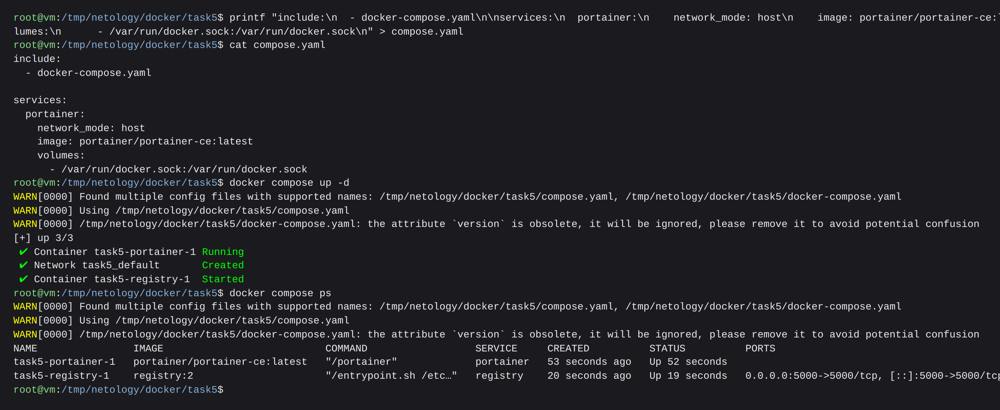

**3.** Заливаем образ в локальный registry.

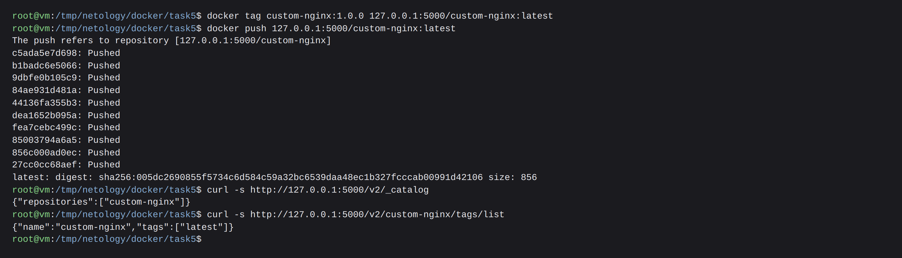

**4.** Начальная настройка Portainer выполнена на `https://127.0.0.1:9443` — задан пароль администратора:

```console
$ docker logs task5-portainer-1 2>&1 | grep -i token
... no administrator account configured; admin initialization and backup restore
require this setup token in the X-Setup-Token header. | setup_token=eb74be505028...
```

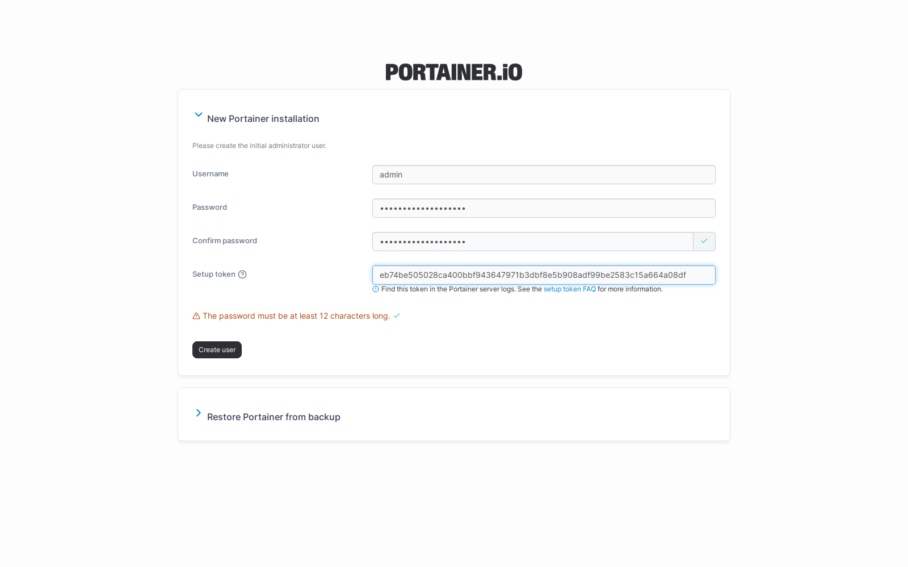

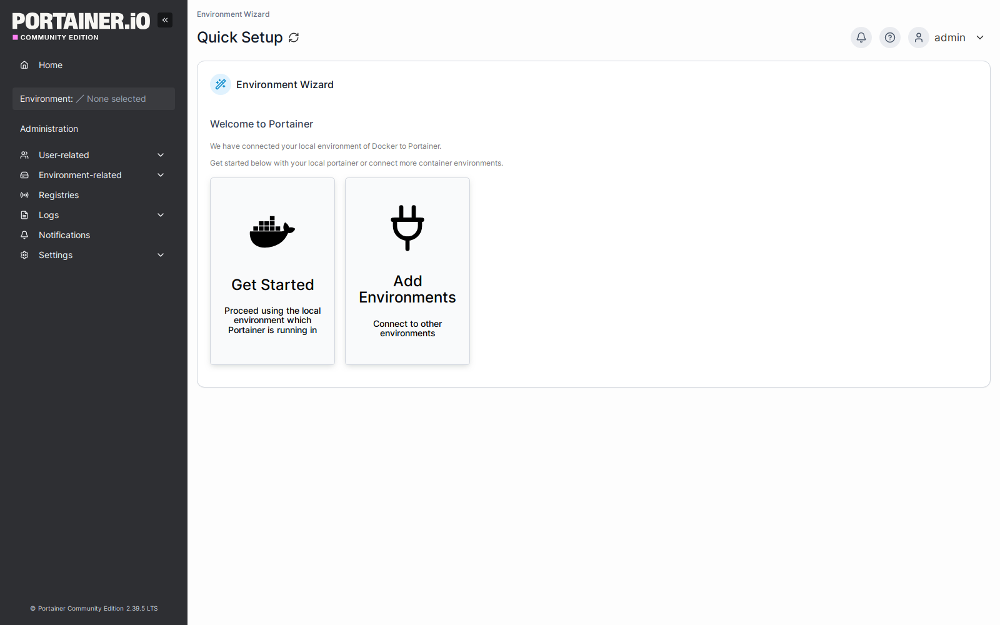

**5.** В `Home → local → Stacks → Add stack → Web editor` задеплоен компоуз:

```yaml
version: '3'

services:
  nginx:
    image: 127.0.0.1:5000/custom-nginx
    ports:
      - "9090:80"
```

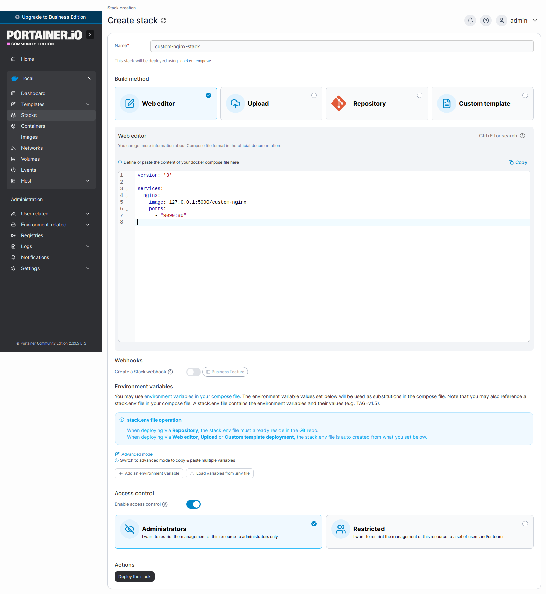

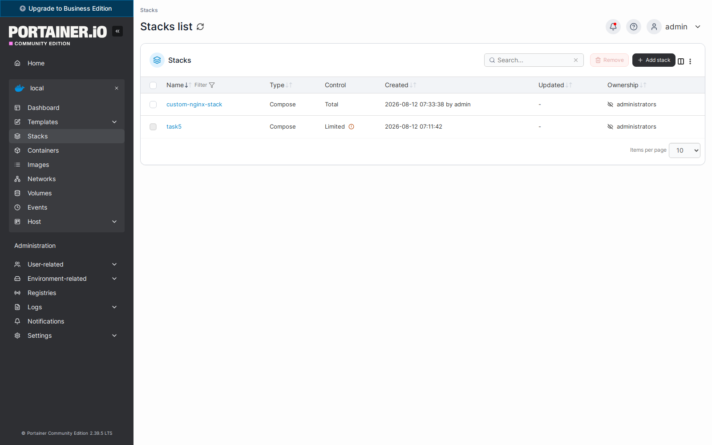

Образ подтянулся из локального registry, контейнер работает и отдаёт страницу:

```console
$ docker ps --format 'table {{.Names}}\t{{.Image}}\t{{.Ports}}'
NAMES                        IMAGE                          PORTS
custom-nginx-stack-nginx-1   127.0.0.1:5000/custom-nginx    0.0.0.0:9090->80/tcp, [::]:9090->80/tcp
task5-registry-1             registry:2                     0.0.0.0:5000->5000/tcp, [::]:5000->5000/tcp
task5-portainer-1            portainer/portainer-ce:latest

$ curl -s http://127.0.0.1:9090 | head -3
<html>
<head>
Hey, Netology
```

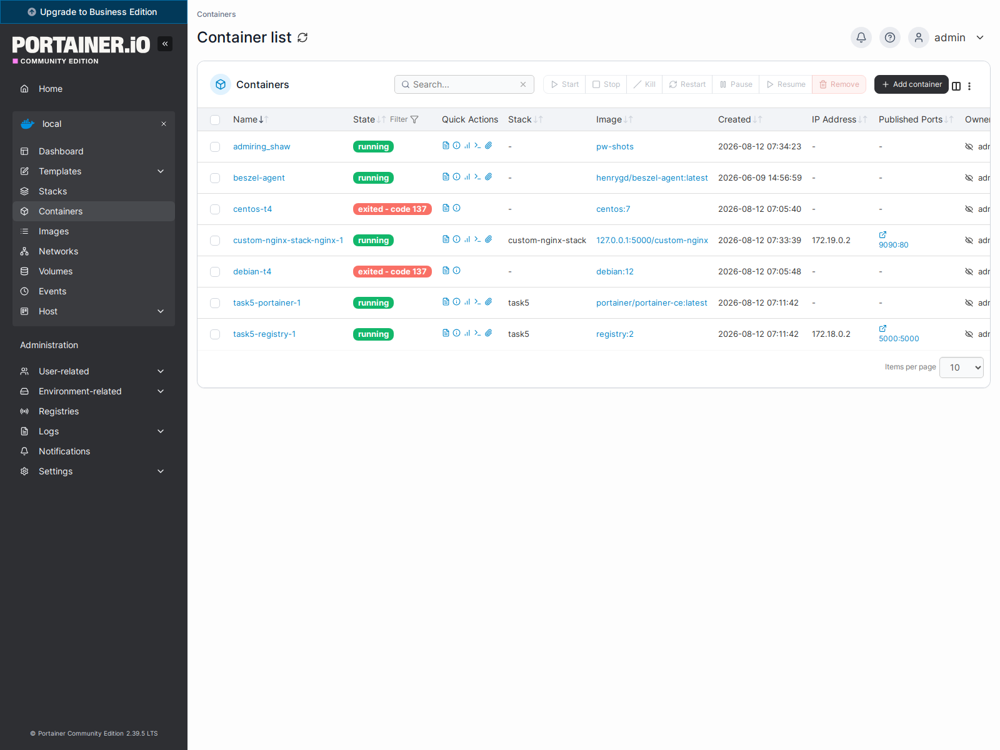

**6.** `Containers → custom-nginx-stack-nginx-1 → Inspect`, представление `<> Tree`, развёрнутое поле `Config` по заданию:

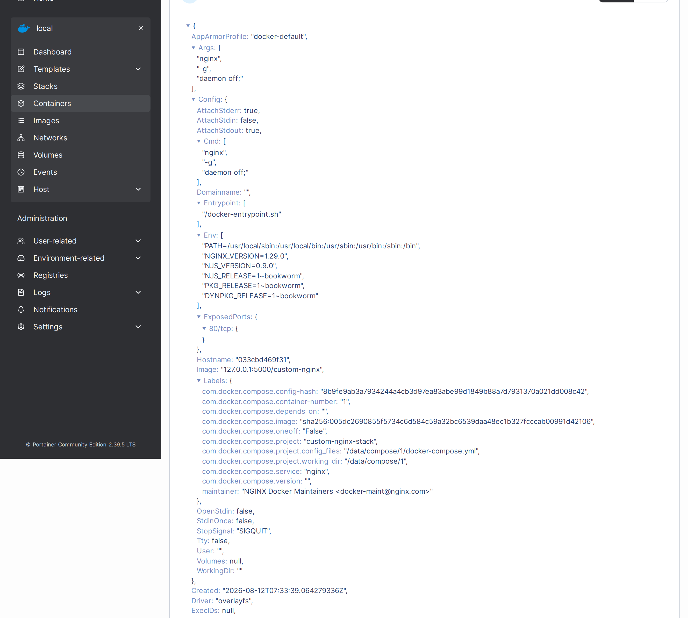

**7.** Удаляем один из манифестов и поднимаем проект заново:

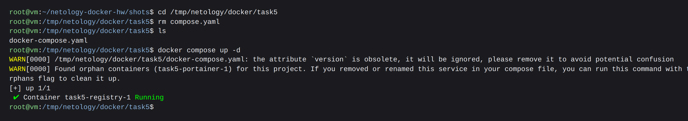

**Суть предупреждений** (их два):

1. `the attribute version is obsolete` — ключ `version` был нужен во времена Compose file format v1/v2/v3, когда номер схемы определял набор доступных возможностей. В Compose Specification (Compose V2) версионирование схемы упразднено: набор полей определяется версией самого `docker compose` Предложенное действие — удалить строку из манифеста:

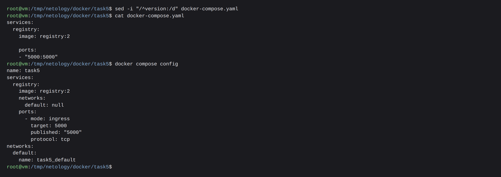

2. `Found orphan containers (task5-portainer-1)` — вместе с `compose.yaml` из проекта пропало описание сервиса `portainer`, но сам контейнер остался запущен и по-прежнему помечен меткой проекта `task5`. Compose видит контейнер, которому больше не соответствует ни один сервис в манифесте, и предупреждает, что не тронет его без явного разрешения. Предложенное действие — флаг `--remove-orphans`.

Гашение всего compose-проекта одной командой:

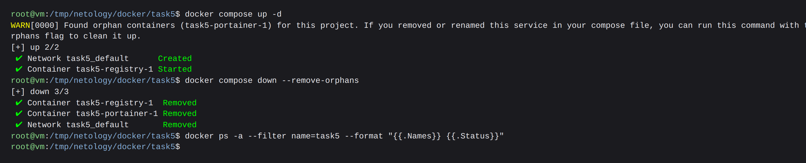
