# Домашнее задание к занятию 5. «Практическое применение Docker»

Fork проекта: **https://github.com/starikam/shvirtd-example-python**

В fork добавлены 5 файлов, содержимое исходных файлов проекта не менялось: `Dockerfile.python`, `compose.yaml`, `.dockerignore`, `.gitignore`, `deploy.sh`.

---

## Задача 0

`docker-compose` в системе отсутствует:

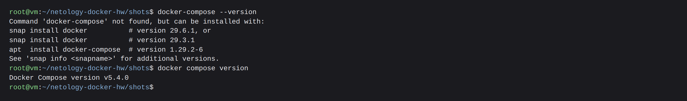

---

## Задача 1

`Dockerfile.python` - multistage-сборка на базе `python:3.12-slim`:

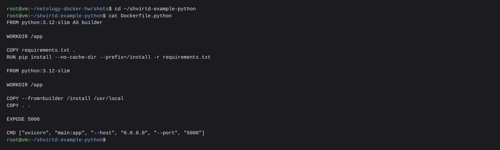

Первый stage ставит зависимости в отдельный префикс `/install`, второй копирует оттуда только готовые пакеты. В финальный образ не попадают ни кеш pip, ни временные файлы установки, а слой с зависимостями пересобирается только при изменении `requirements.txt`.

`.dockerignore` не пускает в образ лишнее (историю git, `.env` с секретами, документацию, конфиги прокси), `.gitignore` - служебные файлы окружения:

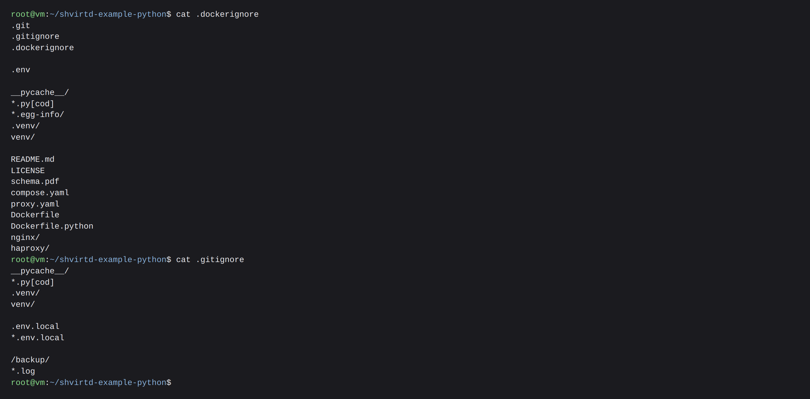

Сборка проходит успешно:

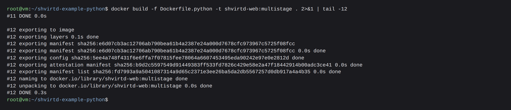

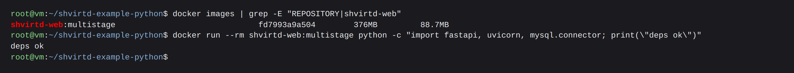

---

## Задача 3

`compose.yaml` подключает `proxy.yaml` через `include` и описывает сервисы `web` и `db`:

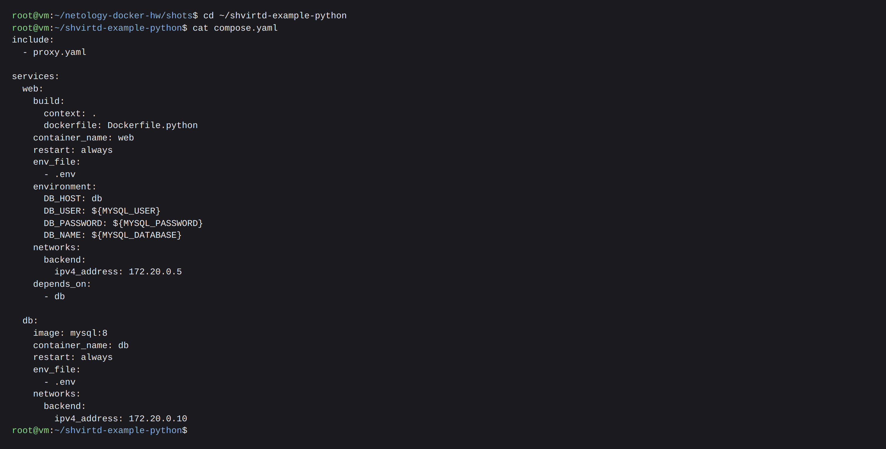

Что содержит файл:

- сеть `backend` (bridge, подсеть `172.20.0.0/24`) объявлена в `proxy.yaml` - благодаря `include` она общая для всех сервисов проекта;
- фиксированные адреса заданы через `networks.backend.ipv4_address`: `web` - `172.20.0.5`, `db` - `172.20.0.10`;
- `restart: always` у обоих сервисов;
- секреты берутся из готового `.env` через `env_file`, оттуда же MySQL получает `MYSQL_ROOT_PASSWORD`, `MYSQL_DATABASE`, `MYSQL_USER`, `MYSQL_PASSWORD`, а приложение - `DB_USER`/`DB_PASSWORD`/`DB_NAME`;
- `DB_HOST: db` - приложение ходит в базу по сетевому имени сервиса.

Запуск проекта:

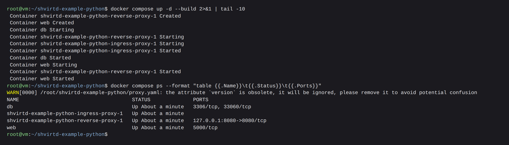

Контейнеры получили нужные адреса, а `curl -L http://127.0.0.1:8090` возвращает время и IP:

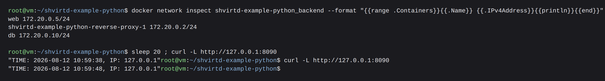

SQL-запрос в базе:

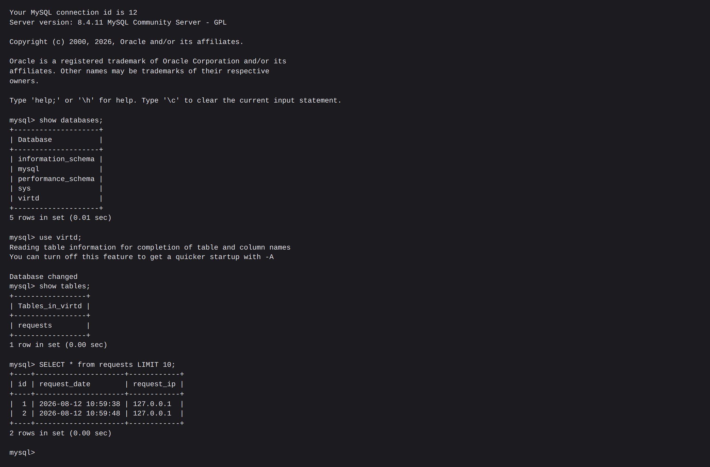

Остановка проекта:

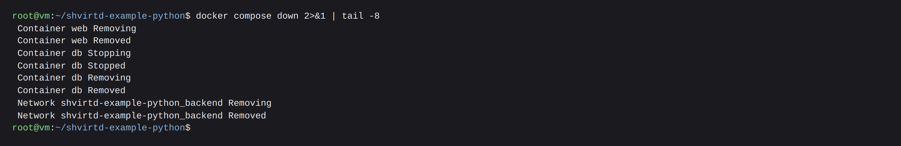

---

## Задача 4

Bash-скрипт `deploy.sh` скачивает fork-репозиторий в `/opt` и поднимает проект целиком:

```bash
#!/usr/bin/env bash
set -euo pipefail

REPO_URL="https://github.com/starikam/shvirtd-example-python.git"
TARGET_DIR="/opt/shvirtd-example-python"

command -v git >/dev/null || { echo "git не установлен"; exit 1; }
docker compose version >/dev/null 2>&1 || { echo "нужен docker с compose-плагином"; exit 1; }

if [ -d "$TARGET_DIR/.git" ]; then
  echo ">>> Репозиторий уже есть, обновляю: $TARGET_DIR"
  git -C "$TARGET_DIR" pull --ff-only
else
  echo ">>> Клонирую $REPO_URL в $TARGET_DIR"
  git clone "$REPO_URL" "$TARGET_DIR"
fi

cd "$TARGET_DIR"

echo ">>> Запускаю проект"
docker compose up -d --build

echo ">>> Состояние сервисов:"
docker compose ps

echo ">>> Проверка:"
for i in $(seq 1 30); do
  if curl -sfL -m 5 http://127.0.0.1:8090 >/dev/null 2>&1; then
    echo -n "OK: "; curl -sL http://127.0.0.1:8090; echo
    exit 0
  fi
  sleep 2
done

echo "Сервис не ответил за 60 секунд, смотрите: docker compose logs"
exit 1
```

---

## Задача 6

Скачиваем образ:

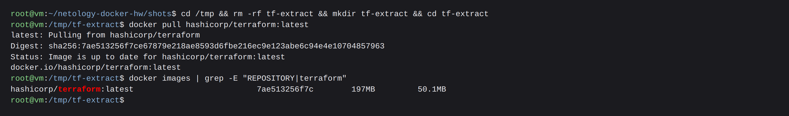

В dive видно, что бинарник лежит в отдельном слое размером 117 MB:

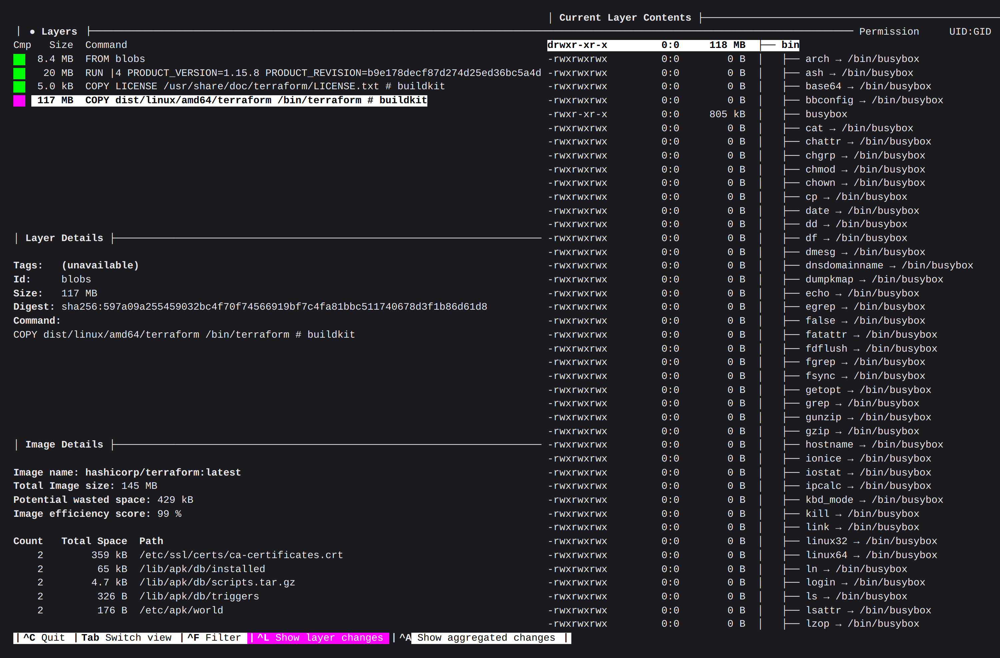

Фильтр по имени файла оставляет в дереве только сам бинарник:

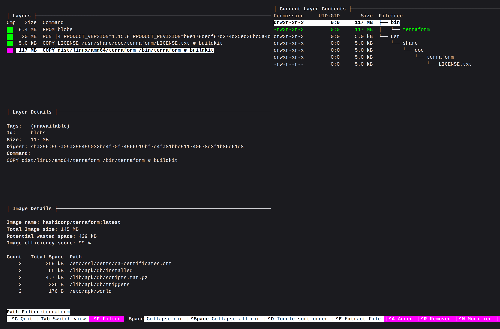

Выгружаем образ через `docker save` и находим нужный слой перебором блобов:

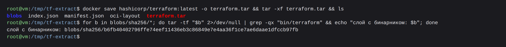

Распаковываем из слоя только `bin/terraform` проверяем, что он запускается:

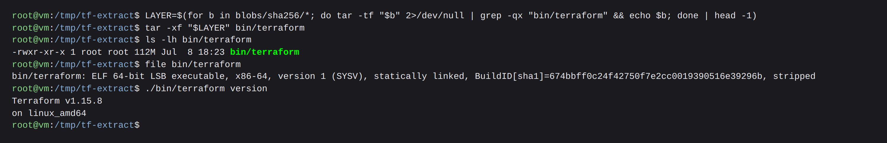
